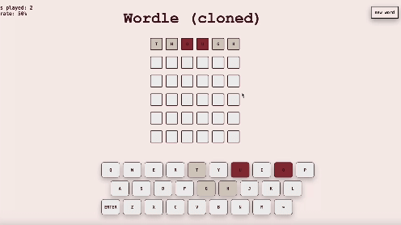

# 6 letter Wordle clone

  

**Description:**  
Wordle, but with 6 letters

**Technology:**  
p5.js

**Prerequisites/Instructions:**  
* 6 chances to guess a 6 letter word
* grey letter: not in the word, light pink letter: in the word, but not in the corrent spot, dark pink letter: correct letter in the correct spot
*press 'new word' to start a new turn

**Credits:**  
* words: https://www.kaggle.com/datasets/ruchi798/part-of-speech-tagging
* possible answer words: https://www.sketchengine.eu/english-word-list/#tab-id-1
